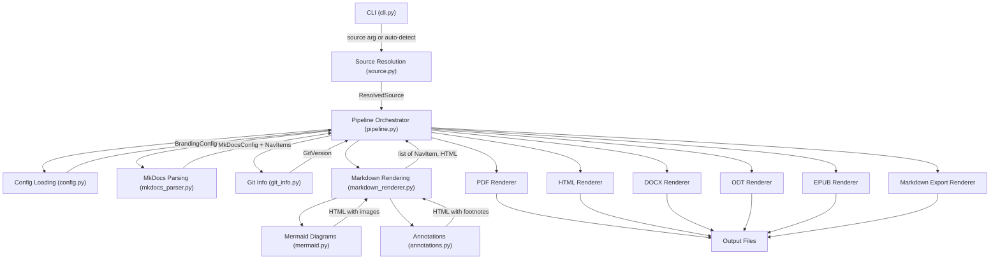
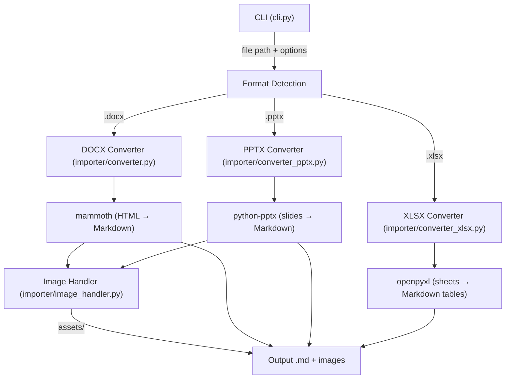

# Architecture

This page describes the leafpress rendering pipeline for contributors and developers who want to understand how MkDocs projects are converted into branded documents.

## Pipeline Overview

## Pipeline Stages

### 1. CLI Entry Point

**Module:** `src/leafpress/cli.py`

The Typer-based CLI parses arguments and invokes the pipeline. The `convert` command accepts a source path (or auto-detects it), output format, branding config path, and rendering options like cover page, TOC, watermark, and local timezone.

The `info` command uses the same source resolution to display project metadata without rendering.

### 2. Source Resolution

**Module:** `src/leafpress/source.py`

`resolve_source(source, branch)` returns a `ResolvedSource` context manager. It detects whether the source is a git URL (via regex) or a local path:

- **Git URLs** are cloned to a temporary directory with optional branch checkout. The temp directory is cleaned up automatically when the context exits.
- **Local paths** are validated and used directly without cleanup.

### 3. Configuration

**Module:** `src/leafpress/config.py`

`BrandingConfig` is a Pydantic model that defines all branding fields (company name, logo, colors, footer options, watermark, etc.). Configuration is loaded from `leafpress.yml` via `load_config()`, with every field overridable via `LEAFPRESS_*` environment variables through `_apply_env_overrides()`.

`config_from_env()` can build a complete config purely from environment variables when no YAML file is available.

### 4. MkDocs Parsing

**Module:** `src/leafpress/mkdocs_parser.py`

`parse_mkdocs_config(config_path)` reads `mkdocs.yml` and returns a `MkDocsConfig` dataclass containing the site name, docs directory, nav structure, markdown extensions, and theme info.

The nav is parsed recursively into `NavItem` trees, then `flatten_nav()` produces a depth-first ordered list where section headers have `path=None` and pages have their markdown file path.

If no `nav` key is defined, `_auto_discover_nav()` walks the docs directory to build one automatically.

### 5. Markdown Rendering

**Module:** `src/leafpress/markdown_renderer.py`

`MarkdownRenderer` converts each page's markdown to HTML using Python-Markdown with a full set of extensions (tables, fenced code, admonitions, footnotes, pymdownx highlight/superfences/tabbed/tasklist/emoji, and more).

After initial conversion, the renderer applies post-processing:

1. **Asset resolution** — rewrites relative `src=` and `href=` attributes to absolute `file://` URIs
2. **Emoji mapping** — resolves `:material-*:` shortcodes to unicode or SVG
3. **Annotation processing** — transforms Material for MkDocs annotation markers into footnotes
4. **Mermaid rendering** — converts fenced mermaid blocks into inline images

### 6. Post-Processing Modules

#### Mermaid Diagrams

**Module:** `src/leafpress/mermaid.py`

`render_mermaid_blocks(html, output_dir)` finds fenced mermaid code blocks in the HTML, encodes each diagram as base64, sends it to `mermaid.ink` for rendering, and replaces the code block with an `` tag pointing to the generated PNG. File names use SHA256 digests for deduplication.

#### Annotations

**Module:** `src/leafpress/annotations.py`

`render_annotations(html)` finds elements with the `annotate` class paired with sibling `<ol>` lists (the Material for MkDocs annotation pattern). It replaces `(N)` text markers with superscript references and converts the ordered list into a styled annotation block.

### Monorepo Pipeline

When `projects` is defined in `leafpress.yml`, the pipeline switches to monorepo mode. Instead of parsing a single `mkdocs.yml`, it processes each sub-project independently and combines the results:

1. **Detection** — if `branding.projects` is non-empty, monorepo mode activates
2. **Per-project processing** — for each entry in `projects`:
    - Resolve the source (local path or git clone for URL entries)
    - Parse the project's own `mkdocs.yml`
    - Detect the project's package version (without walking up to parent directories)
    - Build a **chapter cover page** with per-project metadata (author, subtitle, etc.), falling back to top-level branding values
    - Create a chapter `NavItem` at level 0
    - Flatten the project's nav and **bump all levels by +1** via `bump_nav_levels()`, so project pages nest under the chapter heading
    - Render each page's Markdown to HTML using a project-specific `MarkdownRenderer` (with the project's own extensions and docs directory)
3. **Combination** — all chapter covers and rendered pages are concatenated into a single `html_pages` list
4. **Output** — the combined list is passed to format renderers, producing a single document with chapters

Each sub-project gets its own `MarkdownRenderer` instance, so extension configurations and docs directories are isolated between projects. Git URL projects are cloned to temporary directories and cleaned up automatically after all pages are collected.

### 7. Format Rendering

Each renderer receives `list[tuple[NavItem, str]]` (the nav structure paired with rendered HTML per page) plus branding config, git info, and rendering options.

#### BaseRenderer Protocol & Shared Helpers

**Module:** `src/leafpress/base_renderer.py`

All renderers conform to the `BaseRenderer` protocol, which defines the common constructor and `render()` signatures. This module also provides shared helper functions used across multiple renderers:

| Helper | Purpose | Used by |
|--------|---------|---------|
| `replace_checkboxes(html)` | Replaces `<input type="checkbox">` elements with unicode symbols (☑/☐) for print-friendly output | PDF, HTML, EPUB |
| `make_anchor_id(title)` | Converts a title string to a URL-safe anchor ID | HTML, EPUB |
| `resolve_logo_uri(branding)` | Returns the logo as a `file://` URI or HTTP URL, or empty string | PDF, HTML |

#### Format-Specific Renderers

| Format | Module | Library | Approach |
|--------|--------|---------|----------|
| PDF | `src/leafpress/pdf/renderer.py` | WeasyPrint | Jinja2 HTML templates + CSS, rendered to PDF |
| HTML | `src/leafpress/html/renderer.py` | Jinja2 | Single-file HTML with inline CSS and embedded assets |
| DOCX | `src/leafpress/docx/renderer.py` | python-docx | HTML parsed via custom `html_converter.py` into docx elements |
| ODT | `src/leafpress/odt/renderer.py` | odfpy | Programmatic ODF document construction |
| EPUB | `src/leafpress/epub/renderer.py` | ebooklib | HTML chapters wrapped in EPUB structure |
| Markdown | `src/leafpress/markdown_export/renderer.py` | — | Reads source `.md` files, concatenates with front matter and TOC |

All renderers support cover pages, tables of contents, branding, and watermarks. PDF and HTML use Jinja2 templates in their respective `templates/` directories; DOCX, ODT, and EPUB build documents programmatically. The Markdown export renderer reads source `.md` files directly rather than converting from HTML, preserving the original formatting.

## Import Pipeline

The `leafpress import` command converts Word (`.docx`), PowerPoint (`.pptx`), and Excel (`.xlsx`) files to Markdown. This is a separate pipeline from the convert flow above.

### DOCX Import

**Module:** `src/leafpress/importer/converter.py`

Uses the mammoth library to convert Word documents to HTML, then transforms the HTML to Markdown. Supports image extraction (via `ImageHandler`), configurable code block detection by Word style name, and heading level mapping.

### PPTX Import

**Module:** `src/leafpress/importer/converter_pptx.py`

Uses python-pptx to iterate over slides and extract content:

- **Slide titles** become `## H2` headings (untitled slides get `## Slide N`)
- **Text frames** are converted to Markdown with bold/italic/hyperlink preservation
- **Tables** are rendered as pipe-style Markdown tables
- **Images** are extracted to an `assets/` directory via `ImageHandler.save_image()`
- **Speaker notes** are included as blockquotes (toggleable via `--notes/--no-notes`)
- **Group shapes** are recursed into for nested content

### XLSX Import

**Module:** `src/leafpress/importer/converter_xlsx.py`

Uses openpyxl to read Excel workbooks in data-only mode (computed values, not formulas). Each worksheet becomes a `## Sheet Name` section with a pipe-style Markdown table. The first row is treated as the header. Empty sheets are skipped. No image extraction is needed.

### Image Handler

**Module:** `src/leafpress/importer/image_handler.py`

Shared by both importers. `ImageHandler` manages an output directory for extracted images. `save_image(image_bytes, content_type)` writes image data to `assets/` with content-type-based extensions, returning a relative Markdown image path. The DOCX importer uses `handle_image()` as a mammoth callback; the PPTX importer calls `save_image()` directly.

## Module Map

| Layer | Files | Purpose |
|-------|-------|---------|
| **CLI** | `cli.py` | Command definitions, argument parsing, progress display |
| **Orchestration** | `pipeline.py` | Coordinates all stages of conversion |
| **Input** | `source.py`, `project.py` | Source resolution, project auto-detection |
| **Import** | `importer/converter.py`, `importer/converter_pptx.py`, `importer/converter_xlsx.py`, `importer/image_handler.py` | DOCX/PPTX/XLSX to Markdown conversion |
| **Config** | `config.py`, `exceptions.py` | Branding schema, validation, env overrides |
| **Parsing** | `mkdocs_parser.py` | MkDocs config and nav parsing |
| **Rendering** | `markdown_renderer.py` | Markdown-to-HTML conversion |
| **Post-processing** | `mermaid.py`, `annotations.py` | Diagram and annotation transforms |
| **Renderer base** | `base_renderer.py` | Renderer protocol and shared helpers (checkboxes, anchors, logo URIs) |
| **Output** | `pdf/`, `html/`, `docx/`, `odt/`, `epub/`, `markdown_export/` | Format-specific renderers and templates |
| **Metadata** | `git_info.py` | Git version extraction |
| **Diagnostics** | `doctor.py` | Environment health checks |

## Adding a New Output Format

To add a new output format (e.g., LaTeX):

1. **Create a renderer module** at `src/leafpress/{format}/renderer.py` with a class that satisfies the `BaseRenderer` protocol defined in `src/leafpress/base_renderer.py`. The class must accept `(branding, git_info, mkdocs_cfg)` and implement a `render()` method that produces the output file. Use shared helpers from `base_renderer` (e.g., `replace_checkboxes`, `make_anchor_id`, `resolve_logo_uri`) rather than reimplementing common logic.

2. **Register in `pipeline.py`** — add a branch in the format dispatch logic that instantiates your renderer and calls `render()`.

3. **Add the CLI format option** — extend the format choices in `cli.py` so users can pass `-f {format}`.

4. **Add tests** — create `tests/test_{format}_renderer.py` with cover page, TOC, branding, and watermark tests following the patterns in existing test files.

5. **Document** — add a page in `docs/docs/` and update the nav in `docs/mkdocs.yml`.

## Key Dependencies

LeafPress is built on top of excellent open-source libraries. Here's what powers each layer of the pipeline.

### CLI & Configuration

| Library | Role | Links |
|---------|------|-------|
| [Typer](https://typer.tiangolo.com/) | CLI framework with automatic help and shell completion | [GitHub](https://github.com/fastapi/typer) · [Docs](https://typer.tiangolo.com/) |
| [Rich](https://rich.readthedocs.io/) | Terminal formatting, progress bars, and status spinners | [GitHub](https://github.com/Textualize/rich) · [Docs](https://rich.readthedocs.io/) |
| [Pydantic](https://docs.pydantic.dev/) | Configuration schema validation and environment variable parsing | [GitHub](https://github.com/pydantic/pydantic) · [Docs](https://docs.pydantic.dev/) |
| [PyYAML](https://pyyaml.org/) | YAML config file parsing | [GitHub](https://github.com/yaml/pyyaml) · [PyPI](https://pypi.org/project/PyYAML/) |
| [python-dotenv](https://saurabh-kumar.com/python-dotenv/) | `.env` file loading for environment-based config | [GitHub](https://github.com/theskumar/python-dotenv) |

### Markdown Processing

| Library | Role | Links |
|---------|------|-------|
| [Python-Markdown](https://python-markdown.github.io/) | Core Markdown-to-HTML conversion engine | [GitHub](https://github.com/Python-Markdown/markdown) · [Docs](https://python-markdown.github.io/) |
| [PyMdown Extensions](https://facelessuser.github.io/pymdown-extensions/) | Tabbed content, task lists, code highlighting, emoji, and superfences | [GitHub](https://github.com/facelessuser/pymdown-extensions) · [Docs](https://facelessuser.github.io/pymdown-extensions/) |
| [Pygments](https://pygments.org/) | Syntax highlighting for code blocks | [GitHub](https://github.com/pygments/pygments) · [Docs](https://pygments.org/) |
| [Beautiful Soup](https://www.crummy.com/software/BeautifulSoup/) | HTML post-processing (asset resolution, annotations, mermaid) | [Docs](https://www.crummy.com/software/BeautifulSoup/bs4/doc/) |
| [lxml](https://lxml.de/) | Fast HTML/XML parser backend for Beautiful Soup | [GitHub](https://github.com/lxml/lxml) · [Docs](https://lxml.de/) |
| [Jinja2](https://jinja.palletsprojects.com/) | HTML and PDF template rendering | [GitHub](https://github.com/pallets/jinja) · [Docs](https://jinja.palletsprojects.com/) |

### Output Renderers

| Library | Role | Links |
|---------|------|-------|
| [WeasyPrint](https://weasyprint.org/) | PDF generation from HTML+CSS (optional) | [GitHub](https://github.com/Kozea/WeasyPrint) · [Docs](https://doc.courtbouillon.org/weasyprint/) |
| [python-docx](https://python-docx.readthedocs.io/) | DOCX document generation | [GitHub](https://github.com/python-openxml/python-docx) · [Docs](https://python-docx.readthedocs.io/) |
| [odfpy](https://github.com/eea/odfpy) | ODT (OpenDocument) generation | [GitHub](https://github.com/eea/odfpy) · [PyPI](https://pypi.org/project/odfpy/) |
| [EbookLib](https://github.com/aerkalov/ebooklib) | EPUB generation | [GitHub](https://github.com/aerkalov/ebooklib) · [Docs](https://docs.sourcefabric.org/projects/ebooklib/) |

### Document Import

| Library | Role | Links |
|---------|------|-------|
| [mammoth](https://github.com/mwilliamson/python-mammoth) | Word (.docx) to HTML conversion with semantic style mapping | [GitHub](https://github.com/mwilliamson/python-mammoth) · [PyPI](https://pypi.org/project/mammoth/) |
| [markdownify](https://github.com/matthewwithanm/python-markdownify) | HTML-to-Markdown conversion for the DOCX import pipeline | [GitHub](https://github.com/matthewwithanm/python-markdownify) · [PyPI](https://pypi.org/project/markdownify/) |
| [python-pptx](https://python-pptx.readthedocs.io/) | PowerPoint (.pptx) slide parsing and content extraction | [GitHub](https://github.com/scanny/python-pptx) · [Docs](https://python-pptx.readthedocs.io/) |
| [openpyxl](https://openpyxl.readthedocs.io/) | Excel (.xlsx) workbook reading and cell extraction | [GitHub](https://github.com/theorchard/openpyxl) · [Docs](https://openpyxl.readthedocs.io/) |

### Other

| Library | Role | Links |
|---------|------|-------|
| [GitPython](https://gitpython.readthedocs.io/) | Git tag, branch, and commit extraction for document footers | [GitHub](https://github.com/gitpython-developers/GitPython) · [Docs](https://gitpython.readthedocs.io/) |
| [Requests](https://requests.readthedocs.io/) | HTTP client for diagram fetching and mermaid rendering | [GitHub](https://github.com/psf/requests) · [Docs](https://requests.readthedocs.io/) |
