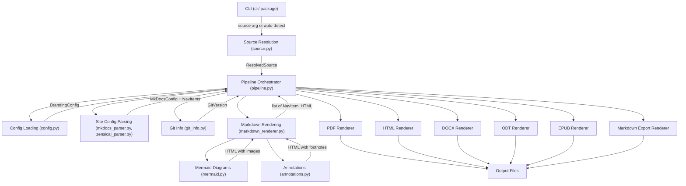
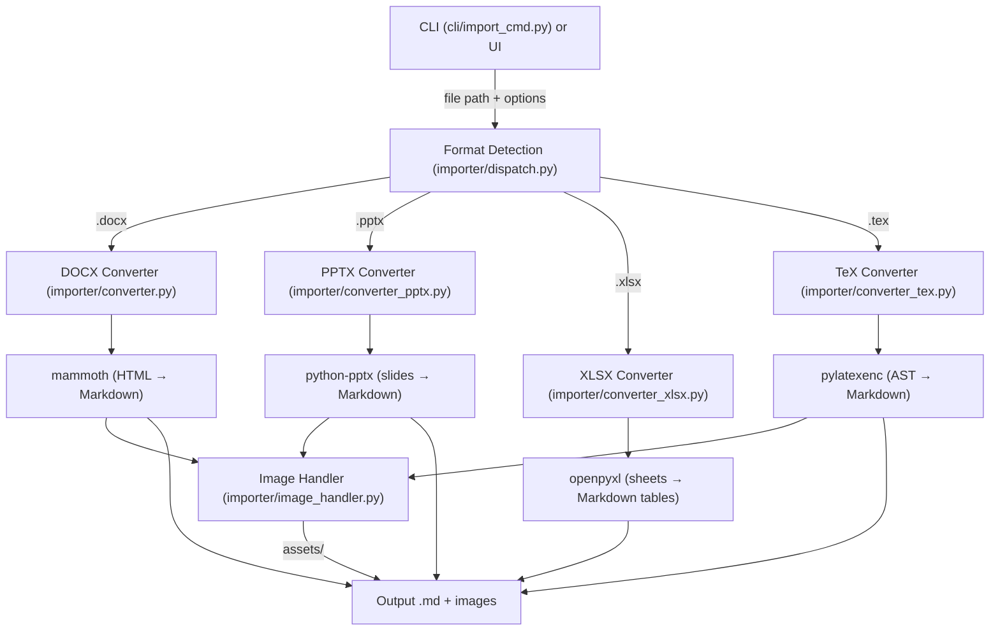

# Architecture

This page describes the leafpress rendering pipeline for contributors and developers who want to understand how MkDocs projects are converted into branded documents.

## Pipeline Overview

```mermaid
flowchart TD
    CLI["CLI (cli/ package)"] --> |"source arg or auto-detect"| SR["Source Resolution (source.py)"]
    SR --> |"ResolvedSource"| PL["Pipeline Orchestrator (pipeline.py)"]
    PL --> CFG["Config Loading (config.py)"]
    PL --> MKP["Site Config Parsing (mkdocs_parser.py, zensical_parser.py)"]
    PL --> GIT["Git Info (git_info.py)"]
    CFG --> |"BrandingConfig"| PL
    MKP --> |"MkDocsConfig + NavItems"| PL
    GIT --> |"GitVersion"| PL
    PL --> MR["Markdown Rendering (markdown_renderer.py)"]
    MR --> MM["Mermaid Diagrams (mermaid.py)"]
    MR --> AN["Annotations (annotations.py)"]
    MM --> |"HTML with images"| MR
    AN --> |"HTML with footnotes"| MR
    MR --> |"list of NavItem, HTML"| PL
    PL --> PDF["PDF Renderer"]
    PL --> HTML["HTML Renderer"]
    PL --> DOCX["DOCX Renderer"]
    PL --> ODT["ODT Renderer"]
    PL --> EPUB["EPUB Renderer"]
    PL --> MDE["Markdown Export Renderer"]
    PDF --> OUT["Output Files"]
    HTML --> OUT
    DOCX --> OUT
    ODT --> OUT
    EPUB --> OUT
    MDE --> OUT
```

## Pipeline Stages

### 1. CLI Entry Point

**Package:** `src/leafpress/cli/`

The Typer-based CLI parses arguments and invokes the pipeline.

- **`cli/app.py`** defines the shared app, console, and `--version`.
- **Command modules:** each subcommand lives in its own module (`convert.py`, `import_cmd.py`, `fetch_diagrams.py`, `info.py`, `init.py`, `doctor.py`, `ui.py`).
- **`cli/__init__.py`** registers the commands in a fixed order and exposes `leafpress.cli:cli`, the console-script entry point.

The `convert` command accepts a source path (or auto-detects it), output format, branding config path, and rendering options like cover page, TOC, watermark, and local timezone.

The `info` command uses the same source resolution to display project metadata without rendering.

### 2. Source Resolution

**Module:** `src/leafpress/source.py`

`resolve_source(source, branch)` returns a `ResolvedSource` context manager. It detects whether the source is a git URL (via regex) or a local path:

- **Git URLs** are cloned to a temporary directory with optional branch checkout. The temp directory is cleaned up automatically when the context exits.
- **Local paths** are validated and used directly without cleanup.

Credentials in git URLs are redacted from all messages (`redact_url()`). `ResolvedSource.is_temporary` marks cloned content as **untrusted**. The pipeline uses it to:

- skip the repo's `.env`;
- keep monorepo `projects[].path` inside the clone;
- turn on HTML sanitizing automatically.

See [Security Layer](#security-layer).

### 3. Configuration

**Module:** `src/leafpress/config.py`

`BrandingConfig` is a Pydantic model that defines all branding fields (company name, logo, colors, footer options, watermark, etc.). Configuration is loaded from `leafpress.yml` via `load_config()`, with every field overridable via `LEAFPRESS_*` environment variables through `_apply_env_overrides()`.

`config_from_env()` can build a complete config purely from environment variables when no YAML file is available. `resolve_mermaid_config()` combines the `mermaid:` settings from YAML, env vars, and the `--mermaid` flag, and applies even without a `leafpress.yml`.

A project's `.env` is read by `pipeline._load_project_env()`, which only takes `LEAFPRESS_*` keys and never runs for cloned sources.

### 4. Site Config Parsing

**Modules:** `src/leafpress/mkdocs_parser.py`, `src/leafpress/zensical_parser.py`

`find_site_config(directory)` locates the site config in this order: `mkdocs.yml`, `mkdocs.yaml`, then `zensical.toml`. `parse_mkdocs_config(config_path)` reads it and returns a `MkDocsConfig` dataclass containing the site name, docs directory, nav structure, markdown extensions, and theme info. A `.toml` path is delegated to `load_zensical_project()` (experimental, see [Zensical Projects](zensical.md)), which maps the `[project]` table onto the same dict shape. It flattens dotted `markdown_extensions` tables back into extension names and parses with `tomli`, which supports TOML 1.1.

`docs_dir` must be inside the project directory. Nav entries that are absolute, use `..`, or are external URLs are dropped. `resolve_page_path()` rejects pages that resolve (including via symlinks) outside `docs_dir`.

The nav is parsed recursively into `NavItem` trees, then `flatten_nav()` produces a depth-first ordered list where section headers have `path=None` and pages have their markdown file path.

If no `nav` key is defined, `_auto_discover_nav()` walks the docs directory to build one automatically.

### 5. Markdown Rendering

**Module:** `src/leafpress/markdown_renderer.py`

`MarkdownRenderer` converts each page's markdown to HTML using Python-Markdown with the extensions configured in the site config. Before building the Markdown instance it:

- confines `pymdownx.snippets` and `pymdownx.b64` to the project directory;
- disables remote snippet downloads;
- refuses `module:Class` references that aren't Markdown `Extension` classes.

Any overrides are reported in `config_warnings`.

After initial conversion, the renderer applies post-processing:

1. **Asset resolution:** rewrites relative `src=` and `href=` attributes to absolute `file://` URIs. Embedded resources (`src`) that resolve outside the project are blanked and reported as blocked.
2. **Emoji mapping** — resolves `:material-*:` shortcodes to unicode or SVG
3. **Annotation processing** — transforms Material for MkDocs annotation markers into footnotes
4. **Mermaid rendering** — converts fenced mermaid blocks into inline images

### 6. Post-Processing Modules

#### Mermaid Diagrams

**Module:** `src/leafpress/mermaid.py`

`render_mermaid_blocks(html, output_dir, server=...)` finds fenced mermaid code blocks in the HTML and encodes each diagram as base64. It sends the diagram to a mermaid.ink-compatible server for rendering: the public `mermaid.ink` by default, or a self-hosted one via `mermaid.server`. It then replaces the code block with an `` tag pointing to the generated PNG. File names use SHA256 digests for deduplication. When mermaid is disabled (`--no-mermaid`), the renderer skips this step and blocks stay as code.

The pipeline creates the image directory with `tempfile.mkdtemp()` and deletes it when conversion finishes or fails. HTML and EPUB output embed the images first, so nothing links into it.

#### Annotations

**Module:** `src/leafpress/annotations.py`

`render_annotations(html)` finds elements with the `annotate` class paired with sibling `<ol>` lists (the Material for MkDocs annotation pattern). It replaces `(N)` text markers with superscript references and converts the ordered list into a styled annotation block.

### Monorepo Pipeline

When `projects` is defined in `leafpress.yml`, the pipeline switches to monorepo mode. Instead of parsing a single `mkdocs.yml`, it processes each sub-project independently and combines the results:

1. **Detection** — if `branding.projects` is non-empty, monorepo mode activates
2. **Per-project processing** — for each entry in `projects`:
    - Resolve the source (local path or git clone for URL entries)
    - Parse the project's own `mkdocs.yml`
    - Detect the project's package version (without walking up to parent directories)
    - Build a **chapter cover page** with per-project metadata (author, subtitle, etc.), falling back to top-level branding values
    - Create a chapter `NavItem` at level 0
    - Flatten the project's nav and **bump all levels by +1** via `bump_nav_levels()`, so project pages nest under the chapter heading
    - Render each page's Markdown to HTML using a project-specific `MarkdownRenderer` (with the project's own extensions and docs directory)
3. **Combination** — all chapter covers and rendered pages are concatenated into a single `html_pages` list
4. **Output** — the combined list is passed to format renderers, producing a single document with chapters

Each project's directory is added to the shared `AssetPolicy`, so images from every chapter can be embedded. Pages from `url:` projects are sanitized. `projects[].path` entries in a cloned repo's `leafpress.yml` must stay inside the clone.

Each sub-project gets its own `MarkdownRenderer` instance, so extension configurations and docs directories are isolated between projects. Git URL projects are cloned to temporary directories and cleaned up automatically after all pages are collected.

### 7. Format Rendering

Each renderer receives `list[tuple[NavItem, str]]` (the nav structure paired with rendered HTML per page) plus branding config, git info, and rendering options.

#### BaseRenderer Protocol & Shared Helpers

**Module:** `src/leafpress/base_renderer.py`

All renderers conform to the `BaseRenderer` protocol, which defines the common constructor and `render()` signatures. This module also provides shared helper functions used across multiple renderers:

| Helper | Purpose | Used by |
|--------|---------|---------|
| `replace_checkboxes(html)` | Replaces `<input type="checkbox">` elements with unicode symbols (☑/☐) for print-friendly output | PDF, HTML, EPUB |
| `make_anchor_id(title)` | Converts a title string to a URL-safe anchor ID | HTML, EPUB |
| `resolve_logo_uri(branding)` | Returns the logo as a `file://` URI or HTTP URL, or empty string | PDF, HTML |
| `build_asset_policy(mkdocs_cfg, branding, extra_roots)` | Default local-file allowlist: the project, `docs_dir`, extra roots (e.g. the mermaid dir), and the logo file | PDF, DOCX, HTML, ODT, EPUB |
| `rewrite_local_images(html, policy, replace)` | Rewrites `` references to allowed files, and blanks references outside the policy | HTML (data URIs), EPUB (packaged items) |
| `image_data_uri(path)` / `image_mime_type(path)` | Encodes a local image as a `data:` URI / guesses its MIME type | HTML, EPUB |

#### Format-Specific Renderers

| Format | Module | Library | Approach |
|--------|--------|---------|----------|
| PDF | `src/leafpress/pdf/renderer.py` | WeasyPrint | Jinja2 HTML templates + CSS, rendered to PDF; every resource is loaded through `RestrictedURLFetcher` (`pdf/url_fetcher.py`) |
| HTML | `src/leafpress/html/renderer.py` | Jinja2 | Single-file HTML with inline CSS; local images and mermaid diagrams embedded as `data:` URIs |
| DOCX | `src/leafpress/docx/renderer.py` | python-docx | HTML parsed via custom `html_converter.py` into docx elements |
| ODT | `src/leafpress/odt/renderer.py` | odfpy | Programmatic ODF document construction; inline images sized to their aspect ratio (Pillow) |
| EPUB | `src/leafpress/epub/renderer.py` | ebooklib | HTML chapters wrapped in EPUB structure; local images packaged as EPUB items |
| Markdown | `src/leafpress/markdown_export/renderer.py` | — | Reads source `.md` files, concatenates with front matter and TOC |

All renderers support cover pages, tables of contents, and branding. All except Markdown export also render watermarks. PDF and HTML use Jinja2 templates in their respective `templates/` directories; DOCX, ODT, and EPUB build documents programmatically. The Markdown export renderer reads source `.md` files directly rather than converting from HTML, preserving the original formatting.

## Security Layer

leafpress often renders content from repositories the operator doesn't control. Every path from content to a file read, a network request, or active output goes through one of these modules:

| Module | Guards |
|--------|--------|
| `asset_policy.py` | `AssetPolicy` allowlist of local roots and files (symlinks resolved), `file_uri_to_path()`, `is_within()`, and `is_public_host()` / `is_public_http_url()` (blocks loopback, private, link-local, and reserved addresses) |
| `pdf/url_fetcher.py` | `RestrictedURLFetcher` for WeasyPrint: `data:` URIs, policy-allowed `file://` paths, and public http(s) only. Each redirect hop is re-checked, and responses are capped at 50 MB |
| `downloads.py` | `download()` for every other HTTP fetch (diagrams, Lucidchart, mermaid, DOCX logo, `import` from URL): http(s) only, streamed with a size cap, redirects re-validated, and an optional public-host requirement |
| `sanitize.py` | `sanitize_html()` (nh3 allowlist tuned to MkDocs/Material output) and `should_sanitize()` precedence: CLI flag, then env var, then always on for cloned sources, then config |
| `source.py` | `redact_url()` removes `user:token@` from anything printed or rendered |

The PDF header/footer CSS escapes its strings (`pdf/styles._css_string_escape`), and colors are validated as hex. Regression tests live in `tests/test_untrusted_content.py`, `tests/test_download_hardening.py`, and `tests/test_sanitize.py`. See also [Remote Sources → Converting untrusted repositories](remote-sources.md#converting-untrusted-repositories).

## Import Pipeline

The `leafpress import` command converts Word (`.docx`), PowerPoint (`.pptx`), Excel (`.xlsx`), and LaTeX (`.tex`) files to Markdown. This is a separate pipeline from the convert flow above. `importer/dispatch.import_document()` routes each file by extension and is shared by the CLI and the desktop UI. Both keep going past a failed file and refuse two inputs that would write the same output file.

```mermaid
flowchart TD
    CLI["CLI (cli/import_cmd.py) or UI"] --> |"file path + options"| DET["Format Detection (importer/dispatch.py)"]
    DET --> |".docx"| DOCXI["DOCX Converter (importer/converter.py)"]
    DET --> |".pptx"| PPTXI["PPTX Converter (importer/converter_pptx.py)"]
    DET --> |".xlsx"| XLSXI["XLSX Converter (importer/converter_xlsx.py)"]
    DET --> |".tex"| TEXI["TeX Converter (importer/converter_tex.py)"]
    DOCXI --> MAM["mammoth (HTML → Markdown)"]
    PPTXI --> PPT["python-pptx (slides → Markdown)"]
    XLSXI --> OPX["openpyxl (sheets → Markdown tables)"]
    TEXI --> PLE["pylatexenc (AST → Markdown)"]
    MAM --> IMG["Image Handler (importer/image_handler.py)"]
    PPT --> IMG
    PLE --> IMG
    IMG --> |"assets/"| OUT["Output .md + images"]
    MAM --> OUT
    PPT --> OUT
    OPX --> OUT
    PLE --> OUT
```

### DOCX Import

**Module:** `src/leafpress/importer/converter.py`

Uses the mammoth library to convert Word documents to HTML, then transforms the HTML to Markdown. Supports image extraction (via `ImageHandler`), configurable code block detection by Word style name, and heading level mapping.

### PPTX Import

**Module:** `src/leafpress/importer/converter_pptx.py`

Uses python-pptx to iterate over slides and extract content:

- **Slide titles** become `## H2` headings (untitled slides get `## Slide N`)
- **Text frames** are converted to Markdown with bold/italic/hyperlink preservation
- **Tables** are rendered as pipe-style Markdown tables
- **Images** are extracted to an `assets/` directory via `ImageHandler.save_image()`
- **Speaker notes** are included as blockquotes (toggleable via `--notes/--no-notes`)
- **Group shapes** are recursed into for nested content

### XLSX Import

**Module:** `src/leafpress/importer/converter_xlsx.py`

Uses openpyxl to read Excel workbooks in data-only mode (computed values, not formulas). Each worksheet becomes a `## Sheet Name` section with a pipe-style Markdown table. The first row is treated as the header. Empty sheets are skipped. No image extraction is needed.

### LaTeX Import

**Module:** `src/leafpress/importer/converter_tex.py`

Uses pylatexenc to parse LaTeX source into an AST, then walks the tree to produce Markdown. Before parsing, `importer/tex_includes.expand_includes()` inlines `\input`/`\include`/`\subfile`/`\import`. Includes must stay inside the document directory, commented-out lines are ignored, and cycles are detected. Beamer overlay specs are also stripped at this stage.

- **Sections** (`\chapter` … `\subparagraph`) become ATX headings and are numbered for cross-references
- **Text**: `importer/tex_symbols.py` converts accents (`\"o` → ö), symbol macros (`\&`, `\ss`, `\ldots`), ligatures (`---`, `--`, TeX quotes, `~`), and siunitx quantities
- **Math**: display environments become `$$...$$`; numbered rows get `\tag{n}`, `\label`/`\nonumber` are stripped, and `align*` is wrapped in `aligned`
- **Cross-references**: `\ref`/`\eqref`/`\autoref`/`\cref`/`\nameref` are emitted as placeholders and resolved after the whole document is walked, so forward references work
- **Lists**, **code blocks**, **links**, and **footnotes** map to their Markdown equivalents
- **Tables** (`tabular`) become pipe tables; cells are converted, and `\multicolumn` content is kept in the first spanned column
- **Figures** use `\caption` as alt text plus a numbered caption line; `subfigure`/`\subfloat` panels get `(a)`, `(b)`
- **Theorem-like environments** and `\newtheorem` become numbered blockquotes; `proof` ends with ∎
- **Beamer** frames become headings with their content
- **Images** (`\includegraphics`) are resolved relative to the `.tex` file (confined to its directory) and copied via `ImageHandler`

### Shared Importer Base

**Module:** `src/leafpress/importer/base.py`

Contains utilities shared across all four converters: `ImportResult` dataclass, `resolve_output_path()`, `postprocess_markdown()`, and `rows_to_pipe_table()`.

### Image Handler

**Module:** `src/leafpress/importer/image_handler.py`

Shared by the DOCX, PPTX, and LaTeX importers. `ImageHandler` manages an output directory for extracted images. `save_image(image_bytes, content_type)` writes image data to `assets/` with content-type-based extensions, returning a relative Markdown image path. The DOCX importer uses `handle_image()` as a mammoth callback; the PPTX and LaTeX importers call `save_image()` directly.

## Module Map

| Layer | Files | Purpose |
|-------|-------|---------|
| **CLI** | `cli/` (`app.py`, `convert.py`, `import_cmd.py`, `fetch_diagrams.py`, `info.py`, `init.py`, `doctor.py`, `ui.py`, `_files.py`) | One module per command; `cli/__init__.py` registers them in `--help` order |
| **Desktop UI** | `ui/app.py` | PyQt6 menu bar / tray app with convert and import windows |
| **Orchestration** | `pipeline.py` | Coordinates all stages of conversion |
| **Input** | `source.py`, `project.py` | Source resolution, project auto-detection |
| **Import** | `importer/dispatch.py`, `importer/base.py`, `importer/converter.py`, `importer/converter_pptx.py`, `importer/converter_xlsx.py`, `importer/converter_tex.py`, `importer/tex_symbols.py`, `importer/tex_includes.py`, `importer/image_handler.py` | DOCX/PPTX/XLSX/LaTeX to Markdown conversion |
| **Config** | `config.py`, `exceptions.py` | Branding schema, validation, env overrides |
| **Parsing** | `mkdocs_parser.py`, `zensical_parser.py` | Site config (mkdocs.yml / zensical.toml) and nav parsing |
| **Security** | `asset_policy.py`, `pdf/url_fetcher.py`, `downloads.py`, `sanitize.py` | File confinement, restricted fetching, bounded downloads, HTML sanitizing |
| **Rendering** | `markdown_renderer.py` | Markdown-to-HTML conversion |
| **Post-processing** | `mermaid.py`, `annotations.py`, `diagrams.py` | Mermaid rendering, annotations, external diagram fetching |
| **Renderer base** | `base_renderer.py` | Renderer protocol and shared helpers (checkboxes, anchors, logo URIs, asset policy, image embedding) |
| **Output** | `pdf/`, `html/`, `docx/`, `odt/`, `epub/`, `markdown_export/` | Format-specific renderers and templates |
| **Metadata** | `git_info.py`, `package_version.py` | Git version extraction, package version detection |
| **Diagnostics** | `doctor.py` | Environment health checks |

## Adding a New Output Format

To add a new output format (e.g., LaTeX):

1. **Create a renderer module** at `src/leafpress/{format}/renderer.py` with a class that satisfies the `BaseRenderer` protocol defined in `src/leafpress/base_renderer.py`. The class must accept `(branding, git_info, mkdocs_cfg)` and implement a `render()` method that produces the output file. Use shared helpers from `base_renderer` (e.g., `replace_checkboxes`, `make_anchor_id`, `resolve_logo_uri`) rather than reimplementing common logic.

2. **Register in `pipeline.py`** — add a branch in the format dispatch logic that instantiates your renderer and calls `render()`.

3. **Add the CLI format option** — extend `OutputFormat` in `cli/app.py` so users can pass `-f {format}`, and pass `asset_policy=asset_policy` from the pipeline if the renderer reads local files (see `CONTRIBUTING.md`).

4. **Add tests** — create `tests/test_{format}_renderer.py` with cover page, TOC, branding, and watermark tests following the patterns in existing test files.

5. **Document** — add a page in `docs/docs/` and update the nav in `docs/mkdocs.yml`.

## Key Dependencies

LeafPress is built on top of excellent open-source libraries. Here's what powers each layer of the pipeline.

### CLI & Configuration

| Library | Role | Links |
|---------|------|-------|
| [Typer](https://typer.tiangolo.com/) | CLI framework with automatic help and shell completion | [GitHub](https://github.com/fastapi/typer) · [Docs](https://typer.tiangolo.com/) |
| [Rich](https://rich.readthedocs.io/) | Terminal formatting, progress bars, and status spinners | [GitHub](https://github.com/Textualize/rich) · [Docs](https://rich.readthedocs.io/) |
| [Pydantic](https://docs.pydantic.dev/) | Configuration schema validation and environment variable parsing | [GitHub](https://github.com/pydantic/pydantic) · [Docs](https://docs.pydantic.dev/) |
| [PyYAML](https://pyyaml.org/) | YAML config file parsing | [GitHub](https://github.com/yaml/pyyaml) · [PyPI](https://pypi.org/project/PyYAML/) |
| [python-dotenv](https://saurabh-kumar.com/python-dotenv/) | `.env` file loading for environment-based config | [GitHub](https://github.com/theskumar/python-dotenv) |
| [tomli](https://github.com/hukkin/tomli) | `zensical.toml` parsing, including TOML 1.1 syntax | [GitHub](https://github.com/hukkin/tomli) · [PyPI](https://pypi.org/project/tomli/) |

### Markdown Processing

| Library | Role | Links |
|---------|------|-------|
| [Python-Markdown](https://python-markdown.github.io/) | Core Markdown-to-HTML conversion engine | [GitHub](https://github.com/Python-Markdown/markdown) · [Docs](https://python-markdown.github.io/) |
| [PyMdown Extensions](https://facelessuser.github.io/pymdown-extensions/) | Tabbed content, task lists, code highlighting, emoji, and superfences | [GitHub](https://github.com/facelessuser/pymdown-extensions) · [Docs](https://facelessuser.github.io/pymdown-extensions/) |
| [Pygments](https://pygments.org/) | Syntax highlighting for code blocks | [GitHub](https://github.com/pygments/pygments) · [Docs](https://pygments.org/) |
| [Beautiful Soup](https://www.crummy.com/software/BeautifulSoup/) | HTML post-processing (asset resolution, annotations, mermaid) | [Docs](https://www.crummy.com/software/BeautifulSoup/bs4/doc/) |
| [lxml](https://lxml.de/) | Fast HTML/XML parser backend for Beautiful Soup | [GitHub](https://github.com/lxml/lxml) · [Docs](https://lxml.de/) |
| [Jinja2](https://jinja.palletsprojects.com/) | HTML and PDF template rendering | [GitHub](https://github.com/pallets/jinja) · [Docs](https://jinja.palletsprojects.com/) |
| [nh3](https://github.com/messense/nh3) | HTML sanitizing (Rust `ammonia`) for untrusted page content | [GitHub](https://github.com/messense/nh3) · [Docs](https://nh3.readthedocs.io/) |

### Output Renderers

| Library | Role | Links |
|---------|------|-------|
| [WeasyPrint](https://weasyprint.org/) | PDF generation from HTML+CSS (optional) | [GitHub](https://github.com/Kozea/WeasyPrint) · [Docs](https://doc.courtbouillon.org/weasyprint/) |
| [python-docx](https://python-docx.readthedocs.io/) | DOCX document generation | [GitHub](https://github.com/python-openxml/python-docx) · [Docs](https://python-docx.readthedocs.io/) |
| [odfpy](https://github.com/eea/odfpy) | ODT (OpenDocument) generation | [GitHub](https://github.com/eea/odfpy) · [PyPI](https://pypi.org/project/odfpy/) |
| [EbookLib](https://github.com/aerkalov/ebooklib) | EPUB generation | [GitHub](https://github.com/aerkalov/ebooklib) · [Docs](https://docs.sourcefabric.org/projects/ebooklib/) |
| [Pillow](https://python-pillow.org/) | Image dimensions for ODT image sizing | [GitHub](https://github.com/python-pillow/Pillow) · [Docs](https://pillow.readthedocs.io/) |

### Document Import

| Library | Role | Links |
|---------|------|-------|
| [mammoth](https://github.com/mwilliamson/python-mammoth) | Word (.docx) to HTML conversion with semantic style mapping | [GitHub](https://github.com/mwilliamson/python-mammoth) · [PyPI](https://pypi.org/project/mammoth/) |
| [markdownify](https://github.com/matthewwithanm/python-markdownify) | HTML-to-Markdown conversion for the DOCX import pipeline | [GitHub](https://github.com/matthewwithanm/python-markdownify) · [PyPI](https://pypi.org/project/markdownify/) |
| [python-pptx](https://python-pptx.readthedocs.io/) | PowerPoint (.pptx) slide parsing and content extraction | [GitHub](https://github.com/scanny/python-pptx) · [Docs](https://python-pptx.readthedocs.io/) |
| [openpyxl](https://openpyxl.readthedocs.io/) | Excel (.xlsx) workbook reading and cell extraction | [GitHub](https://github.com/theorchard/openpyxl) · [Docs](https://openpyxl.readthedocs.io/) |
| [pylatexenc](https://github.com/phfaist/pylatexenc) | LaTeX (.tex) parsing into an AST for the TeX importer | [GitHub](https://github.com/phfaist/pylatexenc) · [Docs](https://pylatexenc.readthedocs.io/) |

### Other

| Library | Role | Links |
|---------|------|-------|
| [GitPython](https://gitpython.readthedocs.io/) | Git tag, branch, and commit extraction for document footers | [GitHub](https://github.com/gitpython-developers/GitPython) · [Docs](https://gitpython.readthedocs.io/) |
| [Requests](https://requests.readthedocs.io/) | HTTP client behind `downloads.download()` (diagrams, mermaid, logos, URL import) | [GitHub](https://github.com/psf/requests) · [Docs](https://requests.readthedocs.io/) |
