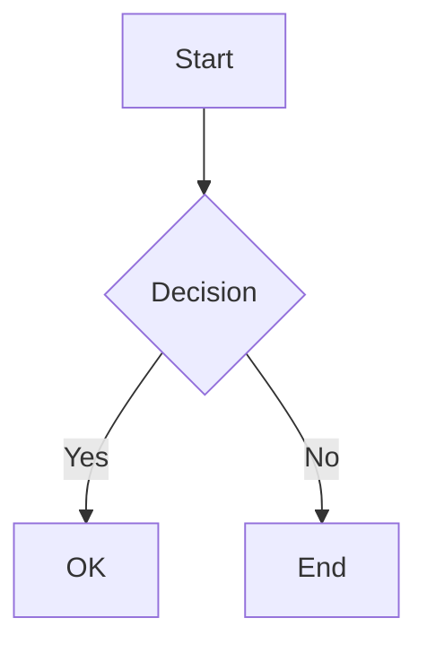

# Markdown Extensions

LeafPress reads the `markdown_extensions` list from your `mkdocs.yml` and applies them during conversion. Any extension that works in a standard MkDocs build will be loaded automatically — no extra configuration needed.

## Supported extensions

### Standard library

These are built into Python's `markdown` package:

| Extension | What it does |
|---|---|
| `meta` | YAML front-matter in Markdown files |
| `toc` | Table of contents from headings |
| `tables` | Pipe-style Markdown tables |
| `fenced_code` | Triple-backtick code blocks |
| `admonition` | `!!! note`, `!!! warning` callout blocks |
| `attr_list` | Add HTML attributes to elements |
| `footnotes` | Footnote references and definitions |
| `def_list` | Definition lists |
| `codehilite` | Syntax highlighting (legacy) |

### PyMdown Extensions

LeafPress supports the [PyMdown Extensions](https://facelessuser.github.io/pymdown-extensions/) commonly used with Material for MkDocs:

| Extension | What it does |
|---|---|
| `pymdownx.highlight` | Syntax highlighting with Pygments |
| `pymdownx.inlinehilite` | Inline code syntax highlighting |
| `pymdownx.superfences` | Enhanced fenced code blocks and custom fences |
| `pymdownx.tabbed` | Tabbed content blocks |
| `pymdownx.details` | Collapsible `<details>` blocks |
| `pymdownx.tasklist` | GitHub-style task lists with checkboxes |
| `pymdownx.emoji` | Emoji shortcodes (`:material-check:`, etc.) |
| `pymdownx.arithmatex` | Math notation (LaTeX-style) |
| `pymdownx.critic` | Critic Markup for track-changes style editing |
| `pymdownx.caret` | Superscript with `^^text^^` |
| `pymdownx.keys` | Keyboard key styling (`++ctrl+c++`) |
| `pymdownx.mark` | Highlighted text with `==text==` |
| `pymdownx.tilde` | Subscript and strikethrough with `~~text~~` |
| `pymdownx.smartsymbols` | Smart typography (arrows, fractions, etc.) |
| `pymdownx.betterem` | Improved emphasis handling |
| `pymdownx.magiclink` | Auto-link URLs and references |
| `pymdownx.snippets` | Include content from other files |
| `pymdownx.striphtml` | Strip HTML comments and tags |

## Mermaid diagrams

LeafPress automatically detects mermaid fenced code blocks and renders them as PNG images using the [mermaid.ink](https://mermaid.ink) service. This works across all output formats — PDF, DOCX, HTML, ODT, and EPUB.

No extra configuration is needed. Just write standard mermaid blocks in your Markdown:

````markdown

````

Mermaid rendering requires internet access during conversion. If the service is unreachable, the original code block is preserved with a warning.

Diagram images are cached by content hash, so identical diagrams across pages are only rendered once.

!!! tip "Line breaks in labels"
    Use `<br/>` for line breaks in mermaid node labels. LeafPress automatically converts literal `\n` text to `<br/>` for compatibility with the mermaid.ink renderer, so both syntaxes work.

!!! tip "External diagrams"
    For diagrams hosted externally (URLs or Lucidchart), LeafPress can fetch and cache them automatically. See [Diagrams](diagrams.md) for the fetch workflow.

## Annotations

LeafPress supports [Material for MkDocs annotations](https://squidfunk.github.io/mkdocs-material/reference/annotations/) — the `(1)` markers you place inside `{ .annotate }` blocks paired with a numbered list of annotation content.

Since annotations normally rely on JavaScript for interactive tooltips, LeafPress renders them as **footnote-style references** in static output:

- `(1)` markers become superscript numbers
- The annotation list is converted to a styled footnote block below the content
- Annotation icons (`:material-*:` shortcodes) are resolved to emoji automatically

This works across all output formats — PDF, DOCX, HTML, ODT, and EPUB.

````markdown
Lorem ipsum dolor sit amet, (1) consectetur adipiscing elit. (2)
{ .annotate }

1. :man_raising_hand: I'm an annotation with an icon!
2. Another annotation with **bold** text.
````

!!! note
    Nested annotations (annotations inside annotations) are not currently supported.

## Unsupported extensions

Extensions that require JavaScript (e.g., MathJax rendering, Mermaid's client-side JS) are handled differently in LeafPress since it produces static documents. Mermaid is supported via server-side rendering (see above). Other JS-dependent extensions may render as raw text.

If an extension fails to load, LeafPress shows a warning with the error details and continues with the remaining extensions.

## How extensions are loaded

1. LeafPress reads the `markdown_extensions` key from `mkdocs.yml`
2. Each extension is validated — unavailable extensions are skipped with a warning that includes the error message and, for missing packages, an install suggestion
3. Extension configs (e.g., `pymdownx.highlight` options) are passed through
4. The `meta`, `toc`, and `tables` extensions are always enabled as a baseline

## Troubleshooting extension failures

When an extension fails to load, LeafPress prints the error message and a hint:

```
⚠ Skipping unavailable extension: pymdownx.superfences
  Error: No module named 'pymdownx'
  Tip: pip install pymdownx  (or uv pip install pymdownx)
```

Common fixes:

| Error | Solution |
|---|---|
| `No module named 'pymdownx'` | Install pymdown-extensions: `pip install pymdown-extensions` |
| `No module named 'some_package'` | Install the package providing the extension |
| Extension loads but produces unexpected output | Check that the extension version matches what your MkDocs build uses |
