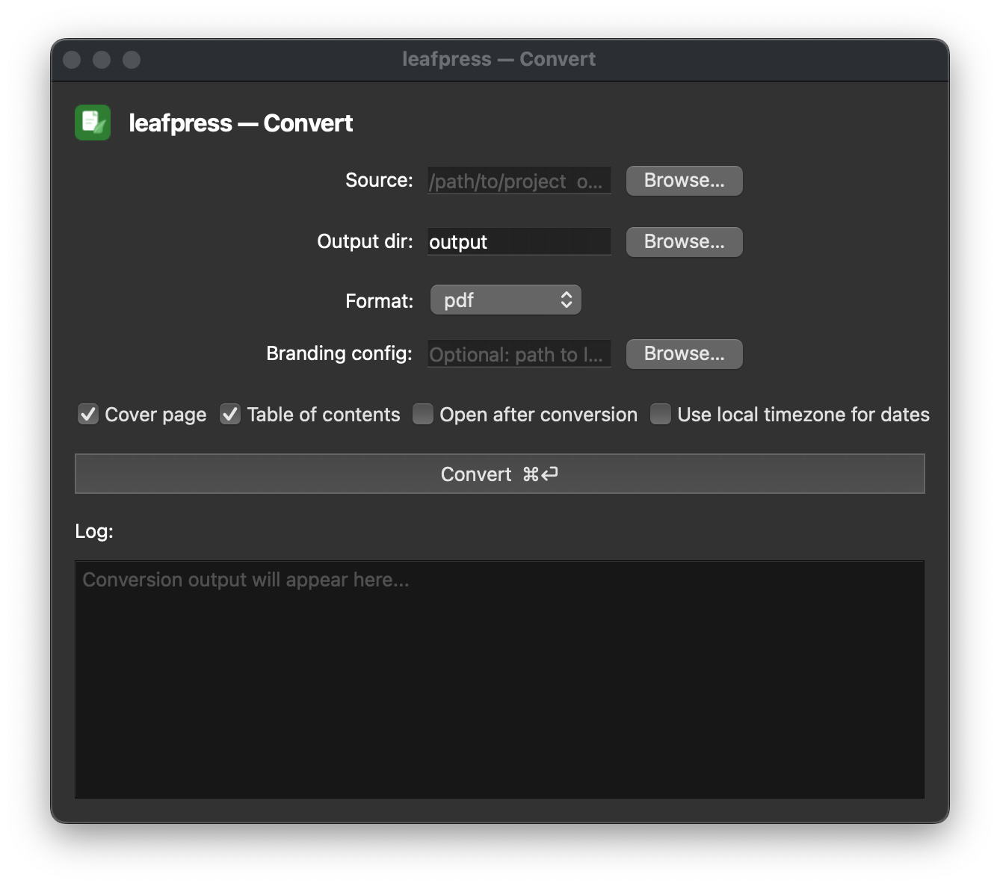
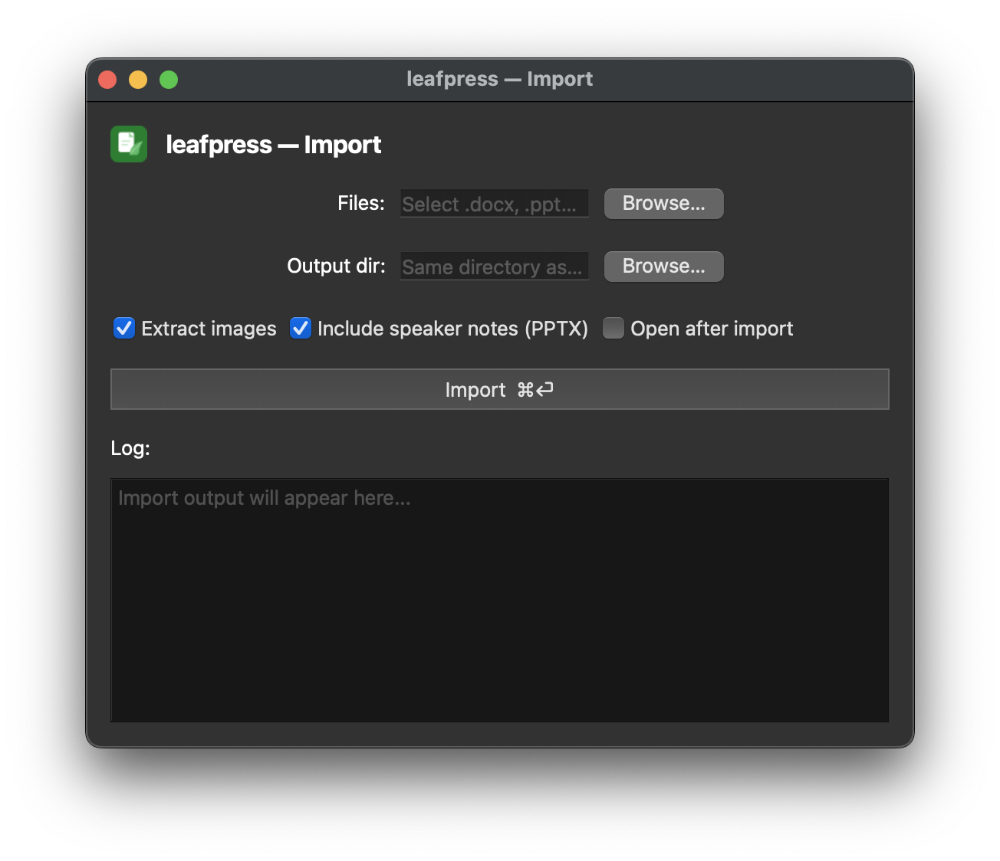

# Desktop UI

leafpress includes a native desktop application — a menu bar / system tray app built with PyQt6. It provides the same conversion and import features as the CLI in a point-and-click interface.

## Installation

The desktop UI requires the `[ui]` optional extra:

=== "uv tool"

    ```bash
    uv tool install 'leafpress[ui]'
    ```

=== "pipx"

    ```bash
    pipx install 'leafpress[ui]'
    ```

=== "uv"

    ```bash
    uv add 'leafpress[ui]'
    ```

=== "pip"

    ```bash
    pip install 'leafpress[ui]'
    ```

This installs:

- **PyQt6** — the cross-platform GUI framework
- **pyobjc-framework-cocoa** (macOS only) — for menu bar integration

## Launching

```bash
# Start in the background (menu bar / tray only)
leafpress ui

# Open the conversion window immediately
leafpress ui --show
```

### macOS

On macOS, leafpress appears in the **menu bar** (top-right area). It does not appear in the Dock. Click the document icon to open the conversion window.

### Linux / Windows

On Linux and Windows, leafpress appears in the **system tray**. Click or double-click the icon to open the conversion window.

## Using the conversion window



The conversion window mirrors all CLI `convert` options:

| Field | Description |
|-------|-------------|
| **Source** | Local path to an MkDocs project, or a git URL. Use "Browse..." to pick a folder. |
| **Output dir** | Directory for generated files (default: `output/`). |
| **Format** | `pdf`, `docx`, `html`, `odt`, `epub`, `markdown`, `both` (PDF + DOCX), or `all`. |
| **Branding config** | Optional path to a `leafpress.yml` file. Leave blank to use auto-detection or environment variables. |
| **Cover page** | Include a cover page (default: checked). |
| **Table of contents** | Include a TOC page (default: checked). |
| **Open after conversion** | Automatically open the generated file(s) when done. |

Click **Convert** to start. A progress indicator appears while conversion runs. A dialog confirms success or shows the error message on failure.

## Using the import window



Import Word (`.docx`), PowerPoint (`.pptx`), and Excel (`.xlsx`) files to Markdown.

| Field | Description |
|-------|-------------|
| **Files** | One or more `.docx`, `.pptx`, or `.xlsx` files to convert. Use "Browse..." to select files. |
| **Output dir** | Directory for generated Markdown files (default: current directory). |
| **Extract images** | Save embedded images alongside the Markdown output (default: checked). |
| **Include speaker notes** | Extract speaker notes from PowerPoint slides (default: checked). |
| **Open after import** | Automatically open the generated Markdown file(s) when done. |

Click **Import** to start. Each file is converted independently and results appear in the log area.

## Tray menu

Right-click (or control-click on macOS) the tray icon for a menu:

- **Open leafpress** — show the conversion window
- **Import files...** — show the import window
- **About leafpress** — version info and links
- **Quit leafpress** — exit the application

## Keeping leafpress running

leafpress stays alive in the menu bar / tray after the conversion window is closed. To quit, use the tray menu.

### macOS — launch at login

To have leafpress start automatically:

1. Open **System Settings → General → Login Items**
2. Add the `leafpress` executable or a shell script that runs `leafpress ui`

Or create a launchd plist at `~/Library/LaunchAgents/com.leafpress.plist`:

```xml
<?xml version="1.0" encoding="UTF-8"?>
<!DOCTYPE plist PUBLIC "-//Apple//DTD PLIST 1.0//EN"
  "http://www.apple.com/DTDs/PropertyList-1.0.dtd">
<plist version="1.0">
<dict>
  <key>Label</key><string>com.leafpress</string>
  <key>ProgramArguments</key>
  <array>
    <string>/usr/local/bin/leafpress</string>
    <string>ui</string>
  </array>
  <key>RunAtLoad</key><true/>
</dict>
</plist>
```

```bash
launchctl load ~/Library/LaunchAgents/com.leafpress.plist
```
