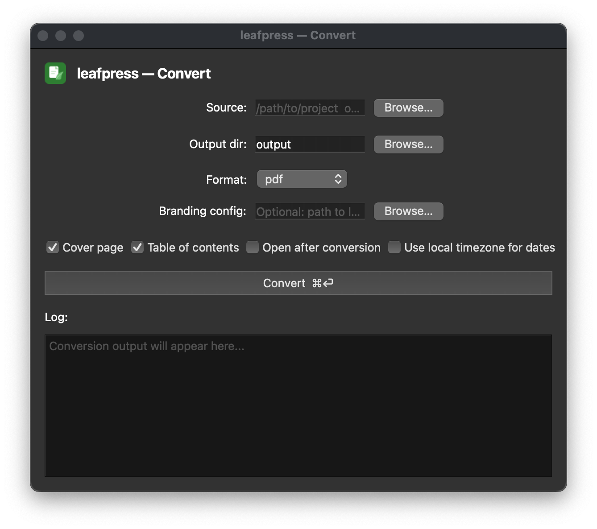
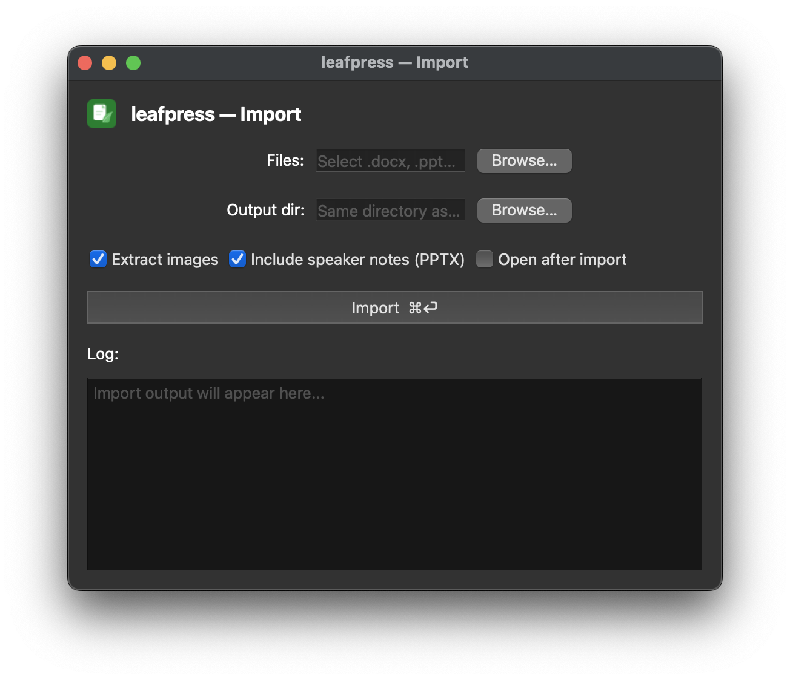

# Desktop UI

leafpress includes a native desktop application — a menu bar / system tray app built with PyQt6. It provides the same conversion and import features as the CLI in a point-and-click interface.

## Installation

The desktop UI requires the `[ui]` optional extra:

=== "uv tool"

    ```bash
    uv tool install 'leafpress[ui]'
    ```

=== "pipx"

    ```bash
    pipx install 'leafpress[ui]'
    ```

=== "uv"

    ```bash
    uv add 'leafpress[ui]'
    ```

=== "pip"

    ```bash
    pip install 'leafpress[ui]'
    ```

This installs:

- **PyQt6** — the cross-platform GUI framework
- **pyobjc-framework-cocoa** (macOS only) — for menu bar integration

## Launching

```bash
# Start in the background (menu bar / tray only)
leafpress ui

# Open the conversion window immediately
leafpress ui --show
```

### macOS

On macOS, leafpress appears in the **menu bar** (top-right area). It does not appear in the Dock. Click the document icon to open the conversion window.

### Linux / Windows

On Linux and Windows, leafpress appears in the **system tray**. Click or double-click the icon to open the conversion window.

## Using the conversion window



The conversion window covers the common `convert` options:

| Field | Description |
|-------|-------------|
| **Source** | Local path to an MkDocs (or [Zensical](zensical.md)) project, or a git URL. Use **Browse…** (or **⌘O** / **Ctrl+O**) to pick a folder. |
| **Output dir** | Directory for generated files (default: `output/`). |
| **Format** | `pdf`, `docx`, `html`, `odt`, `epub`, `markdown`, `both` (PDF + DOCX), or `all`. |
| **Branding config** | Optional path to a `leafpress.yml` file. Leave blank to auto-detect one in the project or use `LEAFPRESS_*` environment variables. |
| **Git branch** | Branch to clone when the source is a git URL (same as `--branch`). Ignored for local folders. |
| **Watermark** | Watermark text such as `DRAFT` (same as `--watermark`). Overrides `watermark.text` from `leafpress.yml`; leave blank to use the config. |
| **Mermaid diagrams** | *From config* (default: render), *Render diagrams*, or *Keep as code*, which sends nothing to the rendering server. Same as `--mermaid` / `--no-mermaid`; see [privacy notes](extensions.md#mermaid-diagrams). |
| **Sanitize HTML** | *Auto* (on for git URL sources, otherwise `sanitize_html` from `leafpress.yml`), *On*, or *Off*. Same as `--sanitize-html` / `--no-sanitize-html`. |
| **Cover page** | Include a cover page (default: checked). |
| **Table of contents** | Include a TOC page (default: checked). |
| **Open after conversion** | Open the generated file(s) with their default applications when done. |
| **Use local timezone for dates** | Show cover and footer dates in local time instead of UTC. |

Click **Convert** (or press **⌘↩** / **Ctrl+Enter**) to start. A progress bar and the log show what's happening, and a dialog reports success or the error. The log shows the same details as the CLI: the detected config and version, Markdown extensions, skipped pages, missing images, and each file written.

Branding (company, logo, colors, footer) comes from `leafpress.yml` or `LEAFPRESS_*` environment variables; see [Configuration](configuration.md). A few options are CLI-only: an explicit site config (`--mkdocs-config`), `--fetch-diagrams`, `--footer-date`, and `--verbose`. For those, use the [CLI](cli.md#convert).

## Using the import window



Import Word (`.docx`), PowerPoint (`.pptx`), Excel (`.xlsx`), and LaTeX (`.tex`) files to Markdown.

| Field | Description |
|-------|-------------|
| **Files** | One or more `.docx`, `.pptx`, `.xlsx`, or `.tex` files. Use **Browse…** (or **⌘O** / **Ctrl+O**) to select them. |
| **Output dir** | Directory for the generated Markdown. Leave blank to save each `.md` next to its source file. |
| **Extract images** | Save embedded images to an `assets/` folder next to the output (default: checked). |
| **Include speaker notes (PPTX)** | Add PowerPoint speaker notes as blockquotes under each slide (default: checked). |
| **Open after import** | Open the generated Markdown file(s) when done. |

Click **Import** (or press **⌘↩** / **Ctrl+Enter**) to start. The import window uses the same converters as [`leafpress import`](import.md):

- Each file is converted independently. A file that fails doesn't stop the rest; the log shows its error, and the final dialog lists every failure ("Imported 2 of 3 file(s)").
- Warnings, such as unsupported LaTeX macros, appear in the log under each file.
- **Name collisions are refused.** If two selected files would produce the same output file (e.g. `a/report.docx` and `b/report.docx` into one output folder), the second is refused rather than overwriting the first.
- Word code-style detection (`--code-styles`) is CLI-only.

## Tray menu

Right-click (or control-click on macOS) the tray icon for a menu:

- **Open leafpress** — show the conversion window
- **Import files...** — show the import window
- **About leafpress** — version info and links
- **Quit leafpress** — exit the application

## Keeping leafpress running

leafpress stays alive in the menu bar / tray after the conversion window is closed. To quit, use the tray menu.

### macOS — launch at login

To have leafpress start automatically:

1. Open **System Settings → General → Login Items**
2. Add the `leafpress` executable or a shell script that runs `leafpress ui`

Or create a launchd plist at `~/Library/LaunchAgents/com.leafpress.plist`:

```xml
<?xml version="1.0" encoding="UTF-8"?>
<!DOCTYPE plist PUBLIC "-//Apple//DTD PLIST 1.0//EN"
  "http://www.apple.com/DTDs/PropertyList-1.0.dtd">
<plist version="1.0">
<dict>
  <key>Label</key><string>com.leafpress</string>
  <key>ProgramArguments</key>
  <array>
    <string>/usr/local/bin/leafpress</string>
    <string>ui</string>
  </array>
  <key>RunAtLoad</key><true/>
</dict>
</plist>
```

```bash
launchctl load ~/Library/LaunchAgents/com.leafpress.plist
```
